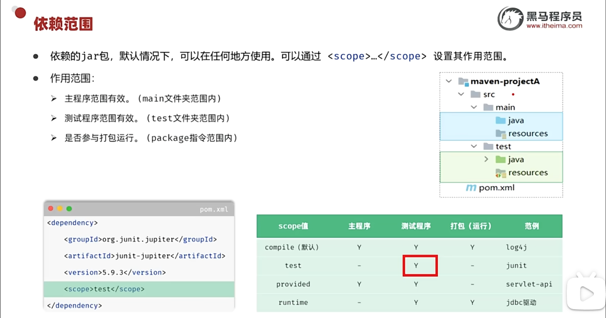
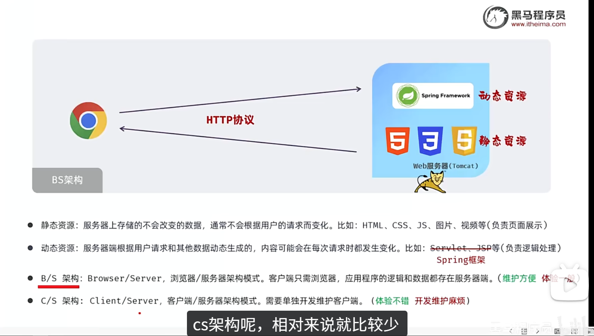

# Javaweb学习

[全网首发AI+JavaWeb开发入门，Tlias教学管理系统项目实战全套视频教程，从需求分析、设计、前后端开发、测试、程序优化到项目部署一套搞定_哔哩哔哩_bilibili](https://www.bilibili.com/video/BV1yGydYEE3H/?spm_id_from=333.337.search-card.all.click&vd_source=9916ba039b625fccde258af0ad4edb7b)


# 1. web前端开发


# 2. web后端开发

## 2.1 Maven

### maven坐标

#### 1. 什么是坐标？

坐标是 Maven 在仓库中**唯一标识**一个 Jar 包的三要素，统称 **GAV**。

#### 2. GAV 三要素详解

- **G (GroupId)**：**组织/公司 ID**。规则：域名倒写。例子：org.springframework (Spring组织), com.alibaba (阿里)。
- **A (ArtifactId)**：**项目/产品名称**。规则：具体的模块名。例子：spring-context (Spring的上下文模块), druid (数据库连接池)。
- **V (Version)**：**版本号**。例子：分为Release（正式版） vs SNAPSHOT（开发版）。6.1.4, 1.0-SNAPSHOT (快照开发版)。

#### 3. 坐标与硬盘路径的关系

坐标直接对应本地仓库的**文件夹层级**。

- **坐标**：org.springframework : spring-context : 6.1.4
- **路径**：repo/org/springframework/spring-context/6.1.4/xxx.jar

#### 4. 坐标的两种写法

- **定义自己**：在 pom.xml 开头，给自己的项目起名字。
- **引用别人**：在 <dependencies> 标签里，告诉 Maven 我需要用谁的 Jar 包。

------


### Maven的5 个关键阶段

| 阶段           | 归属周期 | 核心作用     | 结果/产物                                                    |
| -------------- | -------- | ------------ | ------------------------------------------------------------ |
| **1. clean**   | Clean    | **清理环境** | 删除 target 目录（消除旧文件残留）。                         |
| **2. compile** | Default  | **编译代码** | 将 .java 编译成 .class，放入 target/classes。                |
| **3. test**    | Default  | **运行测试** | 自动运行 src/test 下的单元测试代码。                         |
| **4. package** | Default  | **打包程序** | 将编译好的代码打成 .jar 或 .war 包，放在 target 下。         |
| **5. install** | Default  | **安装入库** | 将打好的包复制到你的**本地仓库** (repo 文件夹)，供其他项目使用。 |

运行后面的阶段 = 自动执行前面所有阶段

注意：clean 属于独立的生命周期。所以，单跑 mvn install 是**不会**执行清理操作的。


## 2.2 测试

单元测试，集成测试，系统测试，验收测试


测试方法：白盒测试，黑盒测试，灰盒测试


### 2.2.1 单元测试（基于JUnit 5）

- **JUnit 5**: 模块化设计，支持参数化测试，与所有主流IDE（IntelliJ, Eclipse）和构建工具（Maven, Gradle）无缝集成。

​	

断言：


Junit5常见注解：


使用maven设置依赖jar包的作用范围：




## 2.3 web基础



---

### 2.3.1 Spring Boot

---

#### 2.3.1.1三层架构与分层解耦

我们遵循**“三层架构”**的设计模式。这就好比经营一家大餐厅，不能让老板一个人既当服务员、又当厨师、还去买菜。必须**分工明确**，才能高效运转。

> **核心口诀：**
> **Controller 只管接待，Service 只管做饭，Dao 只管仓库，Pojo 就是流转的菜。**

---

##### 1. 各层级详细解析 (分工)

| 模块名称                     | 餐厅角色 🏪        | 核心职责 (干什么) 🛠️                                          | 对应的 Spring 注解         |
| :--------------------------- | :---------------- | :----------------------------------------------------------- | :------------------------- |
| **Pojo**<br>(Entity)         | **食材 / 菜品** 🥬 | **数据载体**。<br>不含逻辑，只负责在各层之间传递数据。<br>*(就是端在盘子里的那道菜)* | (通常不需要注解)           |
| **Controller**<br>(Web 层)   | **服务员** 💁‍♂️     | **接待与响应**。<br>1. 接收顾客点单 (Request)。<br>2. 喊后厨做饭 (Call Service)。<br>3. 把菜端给顾客 (Response)。 | `@RestController`          |
| **Service**<br>(业务层)      | **大厨** 👨‍🍳       | **业务逻辑处理**。<br>系统的“大脑”。负责判断用户是否满18岁、密码对不对等。<br>*(最复杂的烹饪手艺都在这)* | `@Service`                 |
| **Dao / Mapper**<br>(持久层) | **采购员** 📦      | **数据存取**。<br>只负责去哪里拿数据（数据库/文件），不管数据拿来干啥。<br>*(只管进货，不问做法)* | `@Mapper` 或 `@Repository` |

---

##### 2. 什么是“解耦”？(为什么要由经理来管人？)

在传统的代码中，大厨（Service）如果要干活，必须自己去指定某一个采购员（Dao）。
```java
// ❌ 耦合代码：大厨直接绑定了具体的采购员（强依赖）
// 如果这个采购员辞职了（代码删了），或者要换个去超市买菜的采购员，大厨的代码就报错了！
private UserDao userDao = new UserDaoImpl(); 
```

**所谓的“解耦”，就是切断这种强绑定关系。** 大厨只管要食材，不关心是谁买回来的。

这就需要引入两个概念：**接口 (Interface)** 和 **Spring 容器 (IOC/DI)**。

*   **接口 (Interface)**：相当于**“岗位说明书”**。
    *   我们要定义一个`UserDao`接口，规定“采购员必须能买到用户数据”。
    *   不管是 `UserDaoTxtImpl`（去菜市场买）还是 `UserDaoMySqlImpl`（去超市买），只要符合说明书，大厨都能用。

*   **Spring IOC (控制反转)**：相当于**“招聘经理”**。
    *   对象的创建权交给 Spring。你不用自己 `new` 对象了，Spring 帮你把对象（Bean）创建好放在容器里。

*   **Spring DI (依赖注入)**：相当于**“指派工作”**。
    *   大厨（Service）只需要喊一声：“我要一个采购员！”（加上 `@Autowired` 注解）。
    *   Spring 经理就会自动把一个符合标准的采购员（Dao）派给大厨。

---

##### 3. 解耦后的工作流程

**✅ 现在的代码 (解耦版)：**

```java
@Service
public class UserService { // 大厨
    
    @Autowired // 👈 关键点：大厨不需要知道采购员的名字，经理(Spring)会自动派一个过来
    private UserDao userDao; 

    public List<User> findAll() {
        // 大厨只管下令“去进货”，不管你是去读 txt 还是读 MySQL
        return userDao.findAll(); 
    }
}
```

**🔄 完整的解耦调用链：**

1.  **浏览器** 发起请求。
2.  **Controller (服务员)** 接到请求，调用 Service 接口。
3.  **Service (大厨)** 接到指令，调用 Dao 接口 *(此时 Spring 已经注入了具体的 Dao 实现)*。
4.  **Dao (采购员)** 执行 SQL 语句，从 **数据库** 拿出数据。
5.  数据封装成 **Pojo (菜品)**，原路返回给顾客。

---

##### 总结

**为什么要解耦？**是为了**应对变化**。
	当你把数据源从 `users.txt` 升级到 `MySQL` 数据库时：

*   **Dao 层**：写一个新的实现类（换个采购员）。
*   **Service 层**：**一行代码都不用改**（大厨根本感觉不到采购员换人了）。
*   **Controller 层**：**一行代码都不用改**（服务员根本感觉不到后厨的变化）。

这就是**高内聚、低耦合**的魅力。


---

#### 2.3.1.2 SpringBoot案例

##### Lombok 与构造器

在实体类（Pojo/Entity）中，我们通常**“无脑”**加上这三个注解，统称为“Lombok 三件套”：

| 注解                      | 作用                                                         | 备注                               |
| :------------------------ | :----------------------------------------------------------- | :--------------------------------- |
| **`@Data`**               | 自动生成 `get`、`set`、`toString`、`equals`、`hashCode` 方法 | 省去几十行样板代码，让类保持清爽。 |
| **`@NoArgsConstructor`**  | 自动生成 **无参构造器**                                      | `public User() {}`                 |
| **`@AllArgsConstructor`** | 自动生成 **全参构造器**                                      | `public User(all args...) {}`      |

---

###### (1) 无参构造器 (`NoArgsConstructor`)

*   **含义**：创建一个“空对象”，不带任何初始数据。
*   **代码体现**：
    ```java
    // 就像拿了一个空碗
    User u = new User(); 
    // 后期再往碗里夹菜（赋值）
    u.setName("张三");
    ```
*   **核心用途**：
    *   **灵活性**：先创建，后赋值。
    *   **框架强制要求**：Spring 和 MyBatis 等框架在底层读取数据库数据时，第一步都是先调用无参构造器实例化对象，如果没这个构造器，程序会**直接报错**。

###### (2) 全参构造器 (`AllArgsConstructor`)
*   **含义**：创建对象的同时，把所有属性都赋好值。
*   **代码体现**：
    ```java
    // 就像端出一碗盛好的饭
    User u = new User(1, "张三", 18);
    ```
*   **核心用途**：
    *   **开发便捷**：一行代码搞定对象创建和赋值，常用于测试数据的编写。

---

###### (3) 重点：如果不使用 Lombok，代码该怎么写？

如果你删掉了 `@NoArgsConstructor` 和 `@AllArgsConstructor`，你需要手写以下代码才能达到同样的效果。

```java
public class User {
    private String name;
    private Integer age;

    // ==========================================
    // 1. 手写无参构造器 (对应 @NoArgsConstructor)
    // ==========================================
    public User() {
        // 里面是空的，什么都不用写，但必须要有这就话
    }

    // ==========================================
    // 2. 手写全参构造器 (对应 @AllArgsConstructor)
    // ==========================================
    public User(String name, Integer age) {
        this.name = name;
        this.age = age;
    }

    // ... 下面还得手写 Getter/Setter/ToString ...
}
```

---

###### (4) 必须要知道的“Java 潜规则”

1.  如果你在类里**什么构造器都不写**，Java 编译器会默认送你一个“无参构造器”。
2.  一旦你写了（或用 Lombok 生成了）一个**全参构造器**，Java 就会**收回**那个默认送的无参构造器。
3.  **后果**：
    *   如果你只加了 `@AllArgsConstructor` 而没加 `@NoArgsConstructor`。
    *   此时你想 `new User()`，或者让 MyBatis 查数据库，程序会报错提示：“找不到无参构造方法”。

**最佳实践结论**：写实体类时，**`@Data` + `@NoArgsConstructor` + `@AllArgsConstructor`** 这三个一起加，永远不会出错！


---

##### **Spring Boot Web 控制器（Controller）** （未分层解耦版）

它的主要功能是：**接收 HTTP 请求，读取服务器本地的一个文本文件（`users.txt`），将文件中的每一行数据解析为 `User` 对象，最后以 JSON 格式返回给前端。**

---

###### 1. 核心注解（Spring MVC 基础）

```java
@RestController // 标识这是一个控制器类，处理HTTP请求
public class UserController {

    @RequestMapping("/list")
    public List<User> list(){ ... }
}
```

*   **`@RestController`**:
    *   这是 `@Controller` 和 `@ResponseBody` 的组合注解。
    *   **含义**：表示这个类是一个控制器，并且这个类中所有方法的返回值（如果是对象或集合）都会自动被序列化成 **JSON** 格式，写入 HTTP 响应体中，而不是跳转到某个 JSP 或 HTML 页面。
*   **`@RequestMapping("/list")`**:
    *   **含义**：建立 URL 映射。当你访问浏览器地址 `http://localhost:端口/list` 时，Spring Boot 会调用这个 `list()` 方法来处理请求。

---

###### 2. 读取资源文件（核心逻辑之一）

代码中展示了两种读取文件的方式，并指出了优劣：

**方式 A：硬编码路径（不推荐）**

```java
// InputStream in = new FileInputStream(new File("D:\\idea_workspace\\...\\users.txt"));
```
*   **问题**：这是**绝对路径**。如果你把代码部署到 Linux 服务器，或者发给同事运行，他们的电脑上可能没有 D 盘，也没有这个文件夹，程序就会报错（找不到文件）。

**方式 B：类加载器读取（推荐）**

```java
InputStream in = this.getClass().getClassLoader().getResourceAsStream("users.txt");
```
*   **含义**：
    *   `src/main/resources` 目录下的文件，在编译后会被放到 **Classpath（类路径）** 的根目录下。
    *   `getClass().getClassLoader()`：获取当前的类加载器。
    *   `getResourceAsStream("users.txt")`：去类路径下找 `users.txt` 并将其作为**输入流（InputStream）** 返回。
*   **优点**：无论代码是在 Windows、Mac 还是 Linux 服务器上运行，只要文件在项目的 `resources` 目录下，都能被找到，具备**可移植性**。

---

###### 3. 使用 Hutool 读取数据

```java
ArrayList<String> lines = IoUtil.readLines(in, StandardCharsets.UTF_8, new ArrayList<>());
```

*   **`cn.hutool.core.io.IoUtil`**:
    *   这是一个第三方工具库 **Hutool** 提供的工具类。Java 原生的 IO 流读取写起来比较繁琐（需要 `BufferedReader`，`InputStreamReader` 等几行代码），Hutool 把它封装成了一行。
*   **`StandardCharsets.UTF_8`**:
    *   指定字符集为 UTF-8。这非常重要，防止中文乱码。
*   **结果**：`lines` 集合中存储了文本文件中的每一行字符串。

---

###### 4. 数据解析与对象封装（Stream 流）

这是 JDK 8+ 的高级写法，用于处理集合数据。

```java
List<User> UserList = lines.stream().map(
        line -> {
            // ... 具体的解析逻辑
            return new User(...);
        }
).toList();
```

*   **`lines.stream()`**: 将 List 集合转换为 Stream 流，准备进行流水线操作。
*   **`.map(...)`**: **映射**操作。它的作用是：**把一种东西变成另一种东西**。在这里，是把“一行字符串（String）”变成“一个用户对象（User）”。
*   **Lambda 表达式内部逻辑**：
    1.  **`line.split(",")`**: 假设文本文件是逗号分隔的（CSV格式），例如 `1,zhangsan,123456,张三,20,2023-01-01 12:00:00`。数组 `parts` 就会拿到切分后的数据。
    2.  **类型转换**:
        *   `Integer.parseInt(parts[0])`: 把字符串 "1" 转为整数 1。
        *   `LocalDateTime.parse(...)`: 把时间字符串转为 Java 的日期时间对象。此处使用了 `DateTimeFormatter` 指定日期格式。
    3.  **`new User(...)`**: 调用构造方法，将解析好的数据封装成对象。
*   **`.toList()`**: (JDK 16+ 新特性) 将处理完的流重新收集成一个 `List<User>` 集合。如果是 JDK 8，通常写成 `.collect(Collectors.toList())`。

---

###### 5. 返回结果

```java
return UserList;
```

*   因为类上有 `@RestController` 注解，Spring Boot 内部的转换器（默认是 Jackson）会把这个 `List<User>` 自动转换为如下的 **JSON 数组**返回给浏览器：

```json
[
  {
    "id": 1,
    "username": "zhangsan",
    "password": "...",
    "name": "张三",
    "age": 20,
    "updateTime": "2023-01-01T12:00:00"
  },
  ...
]
```

---

###### 总结这段代码的执行流程

1.  用户在浏览器发起请求 `/list`。
2.  `UserController` 接收请求。
3.  程序去 `resources` 目录下找到 `users.txt`。
4.  使用 Hutool 工具读取文件所有内容。
5.  使用 Java Stream 流遍历每一行文本，按逗号切割，转换数据类型，并封装成 `User` 对象。
6.  将所有 `User` 对象组成的列表返回。
7.  Spring Boot 将列表转为 JSON 响应给用户。


### 2.3.2 JDBC


### 2.3.3 MyBatis


## 2.4 web后端实战


